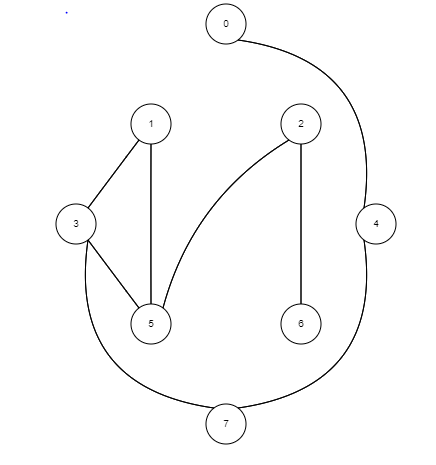
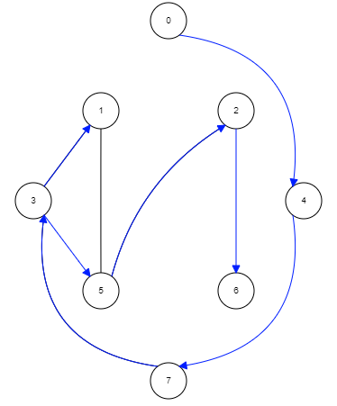

# Asynchronous-BFS
Academic Project for Distributed Computing (CS 6380) course at UT Dallas.

This program is an extention to the HS algorithm (https://github.com/Saquibirtiza/HS-Algorithm) but for asynchronous networks. Instead of a ring network unlike last time, a graph is considered this time with bi-directional links connecting each node. The goal is to elect a leader node within the network.

The program uses a separate input file named "input.txt" from where it reads the user data. The first line of the file is the number of nodes in the graphs (n). Second line contains the root node in the graph. The following 'n' lines contain the adjacency matrix where '1' means there exists a connection between nodes i and j whereas '0' means that there is no connection. In order to make changes to the input, the input file has to be modified only. Once that is done, the java file can be compiled and run to execute the program. 

To compile file -> javac AsynchBFS.java  
To run the file -> java AsynchBFS
 

 
Taking the above example as an input, the output of the algorithm is given as follows:  

 
which shows the path that the messages take during the execution of the algorithm.
